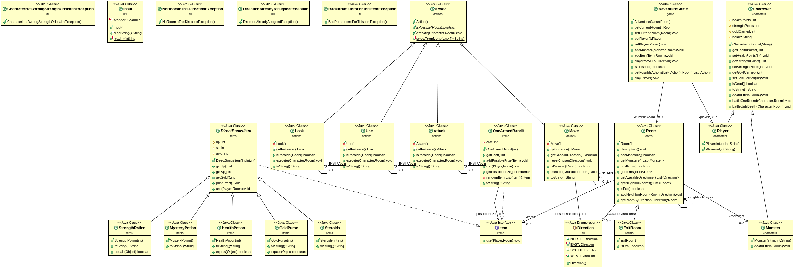
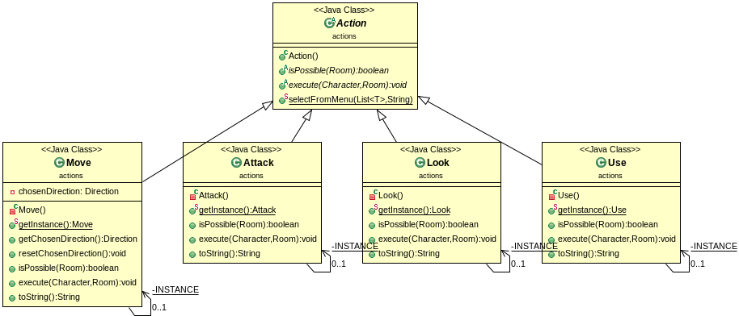
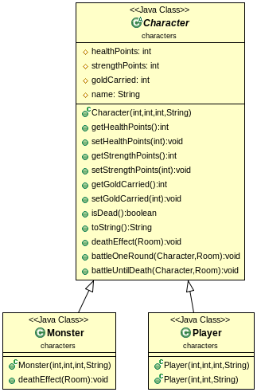
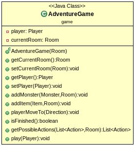
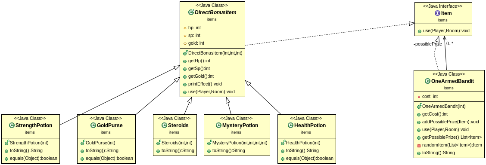
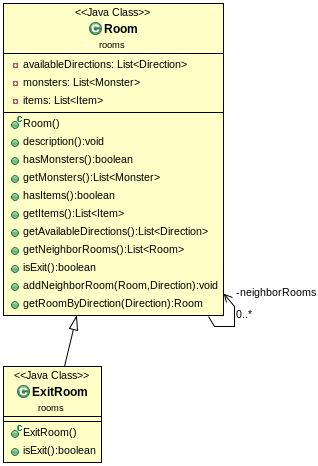
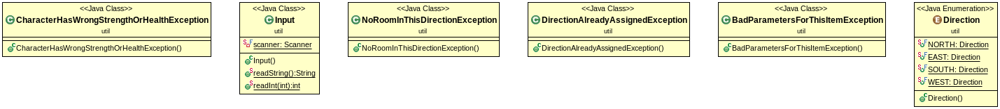
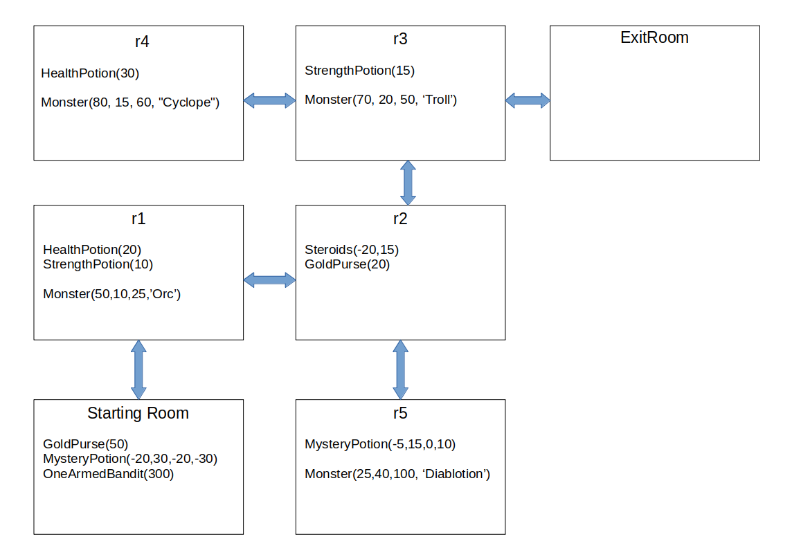

# Projet Donjon

Rendu de KROL Mikolaï et BART Sébastien Groupe 6.

## Introduction

Il s'agissait de construire un jeu de type Rogue-like
dans lequel le joueur se déplace dans un donjon, son but est de trouver la sortie du donjon,
et pour parvenir à ses fins, il peut utiliser différents objets, combattre des monstres, etc...

## "Howto..."

### Récupérer le projet

Pour récupérer le projet, placez vous dans le dossier cloné avec le dépôt git et tapez la commande `git pull`, saisissez
vos identifiants si besoin.

### Générer la documentation

Pour générer la documentation du projet, placez vous à la racine de celui-ci (dossier *donjon*) et tapez `mvn javadoc:javadoc`

La documentation se génère automatiquement, une fois le processus terminé, celle-ci se trouve dans le dossier */target/docs*.
Pour ouvrir l'index, tapez, toujours à la racine `firefox target/docs/index.html`

### Générer le projet

Pour générer le projet, tapez à la racine `mvn package`

Maven compile le projet et génère un fichier *.jar* exécutable, les fichier compilés se trouvent dans le dossier */target/classes*,
le jar exécutable se trouve dans */target*

### Exécuter l'archive générée

Pour exécuter l'archive générée, tapez à la racine `java -jar target/donjon-1.0-SNAPSHOT.jar`, le jeu se lance et vous pouvez
maintenant jouer.

## Notes à propos du code

### Éléments pertinents (d'après nous du moins)
- Les Actions sont des Singletons: on n'a besoin que d'une instance de chaque action tout au long du jeu
- Item n'est pas une classe abstraite mais une interface: les items n'ont pas forcément de propriétés communes, mais ils peuvent tous être utilisés
- Nous n'avons pas fait une classe Potion mais avons fait hériter les items qui avaient un effet direct sur les caractéristiques du joueur de DirectBonusItem, pour simplifier l'implémentation d'autres items qui auraient des effets directs
- La simplicité des méthodes execute() des Actions
- Les nombreuses exceptions pour éviter la création d'objets insensés.

## Diagrammes UML

### Tout le projet  
  

### Actions  
  

### Characters  
  

### Game  
  

### Items  
  

### Rooms  
  

### Util  
  

## Triche pour le main  
  

Fin.
