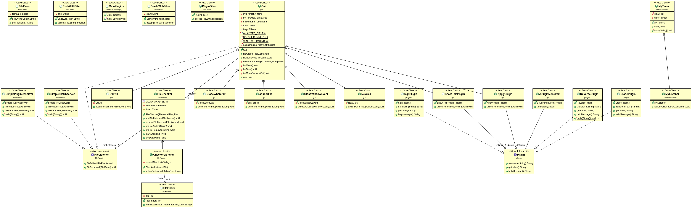
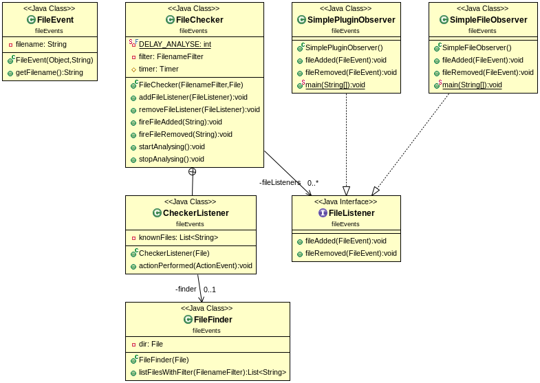
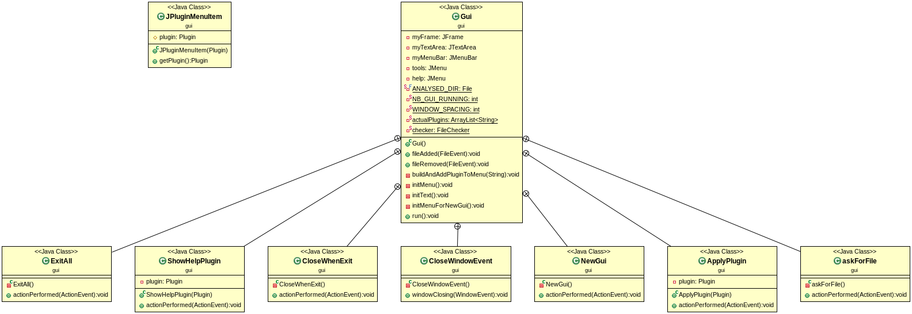
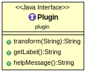
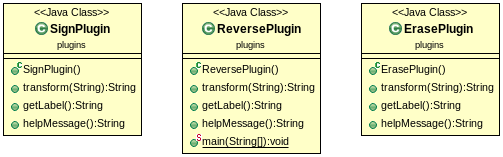
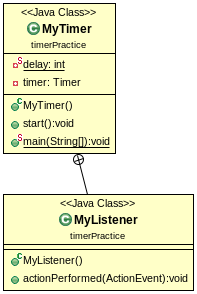
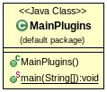

# Projet Plugins

Rendu de KROL Mikolaï et BART Sébastien Groupe 6.

## Introduction

Il s'agissait de construire un éditeur de texte dynamique et réacttif à
l'ajout/le retrait de plugins.

## "How to..."

### Récupérer le projet

Pour récupérer le projet, placez vous dans le dossier cloné avec le dépôt git et tapez la commande `git pull`, saisissez
vos identifiants si besoin.  

### Générer la documentation

Pour générer la documentation du projet, placez vous à la racine de celui-ci (dossier *plugins*) et tapez `mvn javadoc:javadoc`  

La documentation se génère automatiquement, une fois le processus terminé, celle-ci se trouve dans le dossier */target/docs*.  
Pour ouvrir l'index, tapez, toujours à la racine `firefox target/docs/index.html`  

### Générer et mettre en place le projet

Pour générer et mettre en place le projet, tapez à la racine `make use`.

Le Makefile compile le projet et crée un environnement semblable
 à ce qui se trouve dans l'archive **fichiers-plugins.zip** fournie, qui servait d'example.

### Exécuter l'archive générée

Pour exécuter l'archive générée, placez vous dans le dossier *userDir* (`cd userDir`),
puis tapez `java -jar plugins-1.0-SNAPSHOT.jar &`.

### Ajouter / Retirer des plugins

Les plugins disponibles se trouvent dans le dossier *available*.

Pour ajouter un plugin à l'éditeur de texte, il faut déplacer (ou copier/coller) ce plugin 
dans le dossier *extensions/plugins*.

Pour retirer un plugin de l'éditeur de texte, il faut supprimer ce plugin du dossier
*extensions/plugins*.

## Notes à propos du code

- On ne s'est pas attardé sur les plugins, comme ce n'est pas le point
 important du projet. Il y en a troix de disponibles.

### Éléments pertinents (d'après nous du moins)

- Le Makefile

## Diagrammes UML

### Tout les packages  
  

### package fileEvents  
  

### package gui   
  

### package plugin  
  

### package plugins  
  

### package timerPractice  
  

### main  
  

Fin.